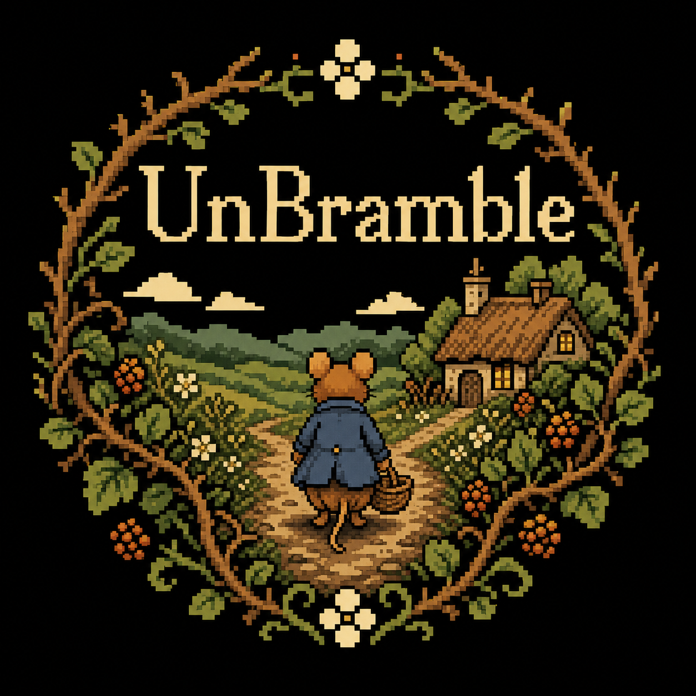

# UnBramble

<p align="center">
  
</p>

*Give your coding agent the map you wish you had.*

In a complex Unity project, the real architecture is scattered across C#, scenes, prefabs, materials, Shader Graphs, Addressables, UnityEvents, packages, and GUIDs. No one keeps every connection in their head — and an agent starting fresh sees even less.

UnBramble gives coding agents a current, queryable map of how the project fits together. They can trace what a change will touch, discover connections that grep and ordinary code search miss, and make better decisions without you walking them through the project first.

## Quick Start

1. Download `unbramble-win-x64.zip` and `unbramble-win-x64.zip.sha256` from the [latest release](https://github.com/i-snyder/unbramble/releases/latest).
2. [Verify the ZIP's checksum](docs/installing.md#install-from-github).
3. Create a folder you'll keep, such as `C:\Users\your-name\Apps\UnBramble`, and extract every file from the ZIP into it.
4. Search the Start menu for **Edit environment variables for your account**. Edit the user variable named `Path`, select **New**, add your UnBramble folder, and select **OK**.
5. Open a new terminal at the root of a Unity project and run:

   ```powershell
   unbramble
   ```

UnBramble will walk you through setup and grow its index. From there, `unbramble --help` shows every path through the hedge.

Setup also adds a small managed instruction block to the project so compatible coding agents know UnBramble is available and when to query it. After that, ask your agent to work normally — you don't need to reintroduce the tool or manually map dependencies for every new session.

UnBramble is self-contained; you don't need .NET or a running Unity Editor. See [installing](docs/installing.md) for checksum verification, upgrades, uninstalling, and WinGet availability. Prefer to inspect and compile it yourself? See [building from source](docs/building.md).

## Why UnBramble?

The hard part of agentic work in Unity is rarely generating code. It's understanding what the change is connected to before touching it.

| Without project-wide dependency awareness | With UnBramble |
| --- | --- |
| Project context must be reconstructed from code search and grep | The agent can query one graph across C# and Unity assets |
| Hidden serialized connections are easy to miss | GUIDs, Shader Graphs, UI Toolkit, Addressables, UnityEvents, asmdefs, managed plugins, and package assets are modeled explicitly |
| The developer has to explain where systems connect | The agent can trace direct and transitive impact on demand |
| “No text match” can look like “unused” | Conservative reachability results include confidence and blind spots |
| Index freshness is another assumption | Every query verifies freshness before answering |

UnBramble doesn't replace the Unity Editor or your IDE. It adds cross-project dependency awareness through a standalone, machine-readable interface while you keep using those tools for what they do best.

See the [technical comparison](docs/comparison.md) for the exact reference forms, sourced tool-by-tool notes, and the limits behind these claims.

## Why should I trust you?

I've worked professionally in games since 2008 and with Unity since 2011. I'm a Unity Certified Instructor, and I've worked with Unity teams ranging from AAA studios to indies.

UnBramble is the tool I developed for my own agentic Unity workflows: I wanted agents to understand a project's code and interconnected assets well enough to do strong work without constant hand-holding. The claims don't rest on my résumé alone — the architecture, known gaps, safety boundaries, and tests are all here in the repository.

## What agents can ask

| When you want to know… | Start here | What you get |
| --- | --- | --- |
| What touches this file, asset, type, or method? | `unbramble who-uses <target>` | Reverse references across assets and C#, direct or transitive |
| What does this asset depend on? | `unbramble uses <target>` | Forward references, direct or transitive |
| Which references are broken? | `unbramble uses <target> --missing-only` | Missing GUID and path references with useful Unity context |
| What may be safe to prune? | `unbramble dead-candidates` | Conservatively screened, unreachable asset and C# candidates with blind spots stated plainly |
| Is the graph still fresh? | Just run a query | Every query checks freshness; a background watcher keeps the common path quick |
| Can an agent consume this reliably? | Use `--json` (`--jsonl` for batch queries) | Stable machine-readable results, non-interactive setup, and explicit confidence |

When full semantic C# analysis isn't available, UnBramble says so and degrades conservatively instead of pretending the answer is complete.

`dead-candidates` is conservative static analysis, not permission to delete blindly. Read its blind-spots footer and use the documented delete-batch → smoke-test workflow.

Design, guarantees, and known gaps live in [`docs/architecture.md`](docs/architecture.md).

Bug reports and focused contributions are welcome. Read [CONTRIBUTING.md](CONTRIBUTING.md) before opening a proposal or pull request.
